<div align="center">

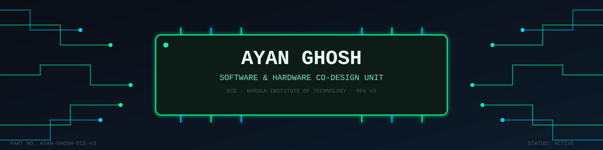

</div>

<br>

<div align="center">

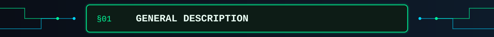

</div>

> The **AYAN-GHOSH-ECE-v3** is a dual-domain processing unit engineered to
> operate across both software and hardware layers. Optimized for embedded
> systems design, VLSI architecture, and robotics integration, this unit
> exhibits stable performance under hackathon-load conditions and continuous
> self-updating firmware (a.k.a. "learning new things").

```diff
+ Core competencies : Software Engineering | Embedded Systems | Digital Electronics
+ Operating mode    : Full-stack across the stack — silicon to syntax
! Note              : Unit is still in active calibration (3rd year, ECE)
```

<div align="center">

</div>

<div align="center">

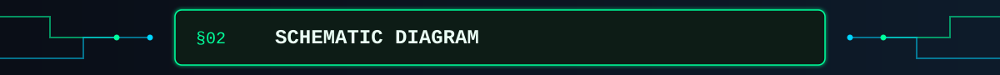

</div>

<div align="center">

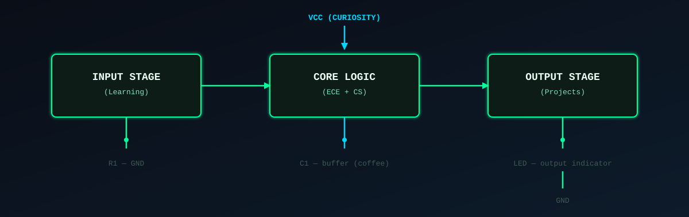

</div>

<div align="center">

</div>

<div align="center">

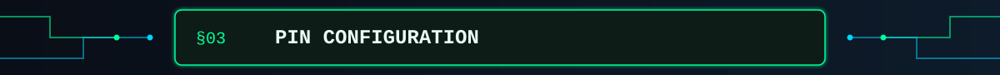

</div>

<div align="center">

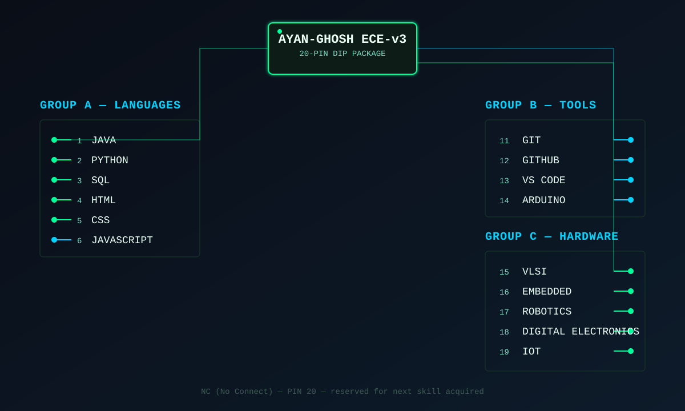

</div>

<div align="center">

| Pin Group | Function | Pin Count |
|---|---|---|
| A — Languages | Core programming stack | 6 |
| B — Tools & Platforms | Dev environment & VCS | 4 |
| C — Hardware / Embedded | ECE domain skills | 5 |
| NC | Reserved / expandable | 1 |

</div>

<div align="center">

</div>

<div align="center">

</div>

<div align="center">

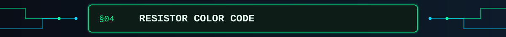

</div>

<div align="center">

| Band Colors | Skill | Value | Tolerance |
|---|---|---|---|
| 🟫🟥🟨 | Java | Core | ±5% |
| 🟨🟪🟧 | Python | Core | ±5% |
| 🟦⬜🟩 | SQL / MySQL | Core | ±5% |
| 🟧🟥⬛ | HTML / CSS / JS | Applied | ±10% |
| 🟩🟫🟥 | Arduino / Embedded | Applied | ±10% |
| ⬜⬛🟦 | VLSI / Digital Electronics | In Training | ±20% |
| 🟥⬜🟪 | Robotics / IoT | In Training | ±20% |

</div>

<div align="center">

</div>

<div align="center">

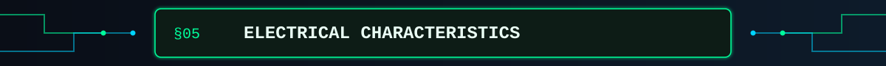

</div>

<div align="center">


</div>

| Parameter                | Symbol | Min | Typ | Max | Unit          |
|---------------------------|--------|-----|-----|-----|---------------|
| Curiosity level            | I_CUR  | 8   | 9.5 | 10  | learners/day  |
| Coffee-to-code ratio       | K_COF  | 1   | 2   | ∞   | cups/commit   |
| Hardware-software balance  | BAL    | —   | 50  | —   | % / %         |
| Debug tolerance            | T_DBG  | 2   | 5   | 12  | hrs           |
| Signal-to-noise (focus)    | SNR    | 20  | 35  | 50  | dB            |

<div align="center">

</div>

<div align="center">

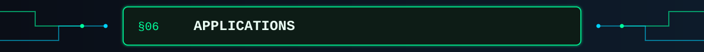

</div>

```
[ VLSI / EMBEDDED SYSTEMS ]──┬──> Digital circuit design, low-level firmware
[ ROBOTICS ]──────────────────┤──> Sensor integration, control systems
[ DIGITAL ELECTRONICS ]───────┤──> Logic design, IoT prototyping
[ SOFTWARE ENGINEERING ]──────┴──> Java · Python · SQL · Web Dev · AI/ML
```

**Roadmap / Absolute Maximum Ratings (Career Goals):**
- `[TARGET]` Well-rounded Software & Hardware Engineer
- `[TARGET]` Hands-on expertise in Embedded Systems & IoT
- `[TARGET]` Strengthened DSA, SQL, and problem-solving stack
- `[TARGET]` Hackathon deployments and real-world engineering trials
- `[TARGET]` Open-source contribution history

<div align="center">

</div>

<div align="center">

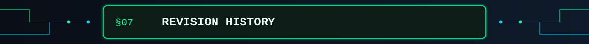

</div>

| Rev | Date       | Description                                  |
|-----|------------|-----------------------------------------------|
| v1  | Year 1     | Initial power-on. Learned syntax fundamentals |
| v2  | Year 2     | Added hardware I/O — Arduino, digital logic   |
| v3  | Year 3 *(current)* | Integrating VLSI, robotics, IoT modules |
| v4  | Year 4 *(planned)* | Full-stack hardware-software deployment|

<div align="center">

</div>

<div align="center">

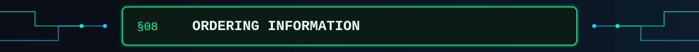

</div>

<div align="center">

<a href="https://ayanghosh-svg.github.io"></a>
<a href="https://github.com/ayanghosh-svg"></a>
<a href="https://www.linkedin.com/in/ayan-ghosh-a32b64388/"></a>

</div>

<div align="center">

```
╔══════════════════════════════════════════════════════════════════╗
║  END OF DATASHEET — Subject to change without notice (I'm still  ║
║  learning). For collaboration inquiries, see §8 above.           ║
╚══════════════════════════════════════════════════════════════════╝
```

</div>
